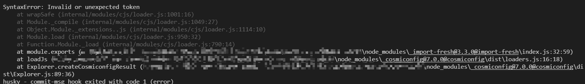
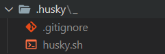
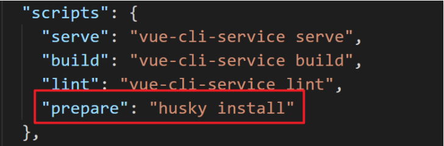
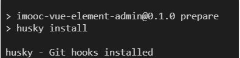
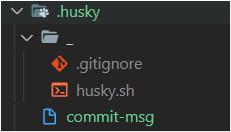

# git hooks

使用了 git cz 来代替了 git commit 实现了规范化的提交诉求，但是依然存在着有人会忘记使用的问题。

而要解决这个问题，就需要先来了解一个概念，叫做 Git hooks（git 钩子 || git 回调方法）。也就是：git 在执行某个事件之前或之后进行一些其他额外的操作。

而我们所期望的 阻止不合规的提交消息，那么就需要使用到 hooks 的钩子函数。

下面是整理出来的所有的 hooks ，大家可以进行一下参考，其中加粗的是常用到的 hooks：

| Git Hook  | 调用时机  | 说明  |
|-----------|---------|------|
| pre-applypatch   | git am执行前      |   |
| applypatch-msg   | git am执行前      |   |
| post-applypatch  | git am执行后      | 不影响git am的结果  |
| **pre-commit**   | git commit执行前  | 可以用git commit --no-verify绕过  |
| **commit-msg**   | git commit执行前  | 可以用git commit --no-verify绕过  |
| post-commit      | git commit执行后  | 不影响git commit的结果  |
| pre-merge-commit | git merge执行前   | 可以用git merge --no-verify绕过  |
| prepare-commit-msg  | git commit执行后，编辑器打开之前  |   |
| pre-rebase       | git rebase执行前  |   |
| post-checkout    | git checkout或git switch执行后  | 如果不使用--no-checkout参数，则在git clone之后也会执行  |
| post-merge  | git commit执行后  | 在执行git pull时也会被调用  |
| pre-push  |  git push执行前 |   |
| pre-receive  | git-receive-pack执行前  |   |
| update  |   |   |
| post-receive  | git-receive-pack执行后  | 不影响git-receive-pack的结果  |
| post-update  |  当 git-receive-pack对 git push 作出反应并更新仓库中的引用时	 |   |
| push-to-checkout  | 当``git-receive-pack对git push做出反应并更新仓库中的引用时，以及当推送试图更新当前被签出的分支且receive.denyCurrentBranch配置被设置为updateInstead`时	  |   |
| pre-auto-gc  | git gc --auto执行前	  |   |
| post-rewrite  | 执行git commit --amend或git rebase时  |   |
| sendemail-validate  | git send-email执行前  |   |
| fsmonitor-watchman  | 配置core.fsmonitor被设置为.git/hooks/fsmonitor-watchman或.git/hooks/fsmonitor-watchmanv2时  |   |
| p4-pre-submit  | git-p4 submit执行前 | 可以用git-p4 submit --no-verify绕过  |
| p4-prepare-changelist  | git-p4 submit执行后，编辑器启动前 | 可以用git-p4 submit --no-verify绕过  |
| p4-changelist  | git-p4 submit执行并编辑完changelist message后  | 可以用git-p4 submit --no-verify绕过  |
| p4-post-changelist  | git-p4 submit执行后	  |   |
| post-index-change  | 索引被写入到read-cache.c do_write_locked_index后  |   |

整体的 hooks 非常多，当时我们其中用的比较多的其实只有两个：pre-commit 和 commit-msg。

简单来说这两个钩子：

- commit-msg：可以用来规范化标准格式，并且可以按需指定是否要拒绝本次提交
- pre-commit：会在提交前被调用，并且可以按需指定是否要拒绝本次提交

而我们接下来要做的关键，就在这两个钩子上面。
	
## 使用 husky + commitlint 检查提交描述是否符合规范要求

1. commitlint：用于检查提交信息

2. husky：是git hooks工具

注意：npm 需要在 7.x 以上版本！

### commitlint

1. 安装依赖：

```bash
npm install --save-dev @commitlint/config-conventional@12.1.4 @commitlint/cli@12.1.4
```

2. 创建 commitlint.config.js 文件

```bash
echo "module.exports = {extends: ['@commitlint/config-conventional']}" > commitlint.config.js
```

3. 打开 commitlint.config.js ， 增加配置项（ [config-conventional 默认配置点击可查看](https://github.com/conventional-changelog/commitlint/blob/master/@commitlint/config-conventional/index.js) ）：

```js
module.exports = {
  // 继承的规则
  extends: ['@commitlint/config-conventional'],
  // 定义规则类型
  rules: {
    // type 类型定义，表示 git 提交的 type 必须在以下类型范围内
    'type-enum': [
      2,
      'always',
      [
        'feat', // 新功能 feature
        'fix', // 修复 bug
        'docs', // 文档注释
        'style', // 代码格式(不影响代码运行的变动)
        'refactor', // 重构(既不增加新功能，也不是修复bug)
        'perf', // 性能优化
        'test', // 增加测试
        'chore', // 构建过程或辅助工具的变动
        'revert', // 回退
        'build' // 打包
      ]
    ],
    // subject 大小写不做校验
    'subject-case': [0]
  }
}
```

注意：确保保存为 UTF-8 的编码格式，否则可能会出现以下错误：


		
## husky

1. 安装依赖：

```bash
npm install husky@7.0.1 --save-dev
```

2. 启动 hooks ， 生成 .husky 文件夹

```bash
npx husky install

# 或
pnpm dlx husky install
```



3. 在 package.json 中生成 prepare 指令（ 需要 npm > 7.0 版本 ）

```bash
npm set-script prepare "husky install"
```



4. 执行 prepare 指令

```bash
npm run prepare
```

5. 执行成功，提示



6. 添加 commitlint 的 hook 到 husky中，并指令在 commit-msg 的 hooks 下执行 npx --no-install commitlint --edit "$1" 指令

```bash
npx husky add .husky/commit-msg 'npx --no-install commitlint --edit "$1"'

# 或
pnpm dlx  husky add .husky/commit-msg 'npx --no-install commitlint --edit "$1"'
```

7. 此时的 .husky 的文件结构



至此， 不符合规范的 commit 将不再可提交