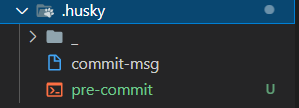

# 通过 pre-commit 检测提交时代码规范

在 ESLint 与 Prettier 配合解决代码格式问题 的文档中，讲解了如何处理本地代码格式问题。

但是这样的一个格式处理问题，他只能够在本地进行处理，并且我们还需要 手动在 VSCode 中配置自动保存 才可以。那么这样就会存在一个问题，要是有人忘记配置这个东西了怎么办呢？他把代码写的乱七八糟的直接就提交了怎么办呢？

所以我们就需要有一种方式来规避这种风险。

那么想要完成这么一个操作就需要使用 husky 配合 eslint 才可以实现。

我们期望通过 husky 监测 pre-commit 钩子，在该钩子下执行 npx eslint --ext .js,.vue src 指令来去进行相关检测：

1. 执行 npx husky add .husky/pre-commit "npx eslint --ext .js,.vue src" 添加 commit 时的 hook （npx eslint --ext .js,.vue src 会在执行到该 hook 时运行）

2. 该操作会生成对应文件 pre-commit：



3. 关闭 VSCode 的自动保存操作

4. 修改一处代码，使其不符合 ESLint 校验规则

5. 执行 提交操作 会发现，抛出一系列的错误，代码无法提交

6. 想要提交代码，必须处理完成所有的错误信息

## lint-staged 自动修复格式错误

通过 pre-commit 处理了 检测代码的提交规范问题，当我们进行代码提交时，会检测所有的代码格式规范 。

但是这样会存在两个问题：

1. 我们只修改了个别的文件，没有必要检测所有的文件代码格式
2. 它只能给我们提示出对应的错误，我们还需要手动的进行代码修改

那么想要处理这两个问题，就需要使用另外一个插件 lint-staged ！

lint-staged 可以让你当前的代码检查 只检查本次修改更新的代码，并在出现错误的时候，自动修复并且推送。

lint-staged 无需单独安装，我们生成项目时，vue-cli 已经帮助我们安装过了，所以我们直接使用就可以了

1. 修改 package.json 配置

```json
"lint-staged": {
    "src/**/*.{js,vue}": [
        "eslint --fix",
        "git add"
    ]
}
```

2. 如上配置，每次它只会在你本地 commit 之前，校验你提交的内容是否符合你本地配置的 eslint规则(这个见文档 ESLint )，校验会出现两种结果：
   1. 如果符合规则：则会提交成功。
   2. 如果不符合规则：它会自动执行 eslint --fix 尝试帮你自动修复，如果修复成功则会帮你把修复好的代码提交，如果失败，则会提示你错误，让你修好这个错误之后才能允许你提交代码。

3. 修改 .husky/pre-commit 文件

```
#!/bin/sh
. "$(dirname "$0")/_/husky.sh"

npx lint-staged
```

4. 再次执行提交代码

5. 发现 暂存区中 不符合 ESlint 的内容，被自动修复
